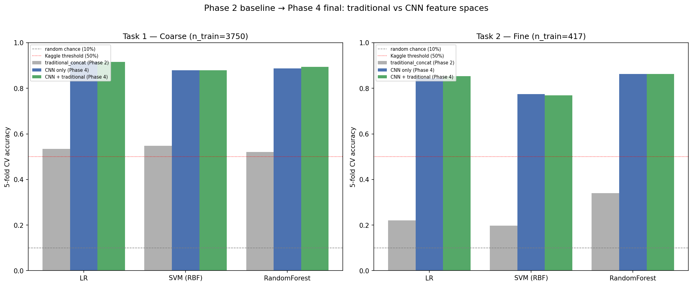
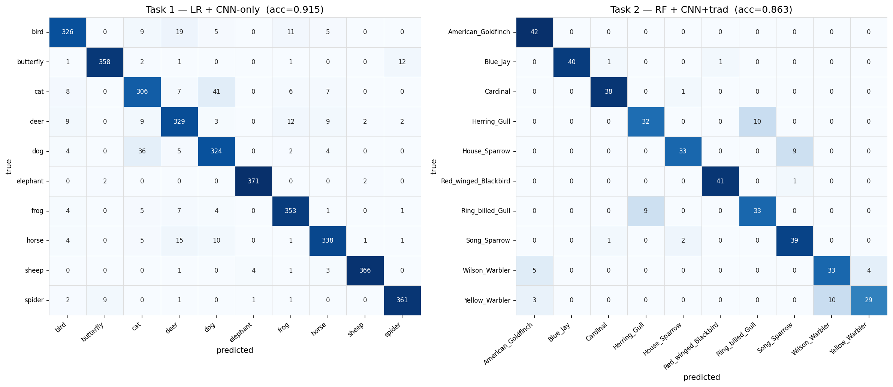
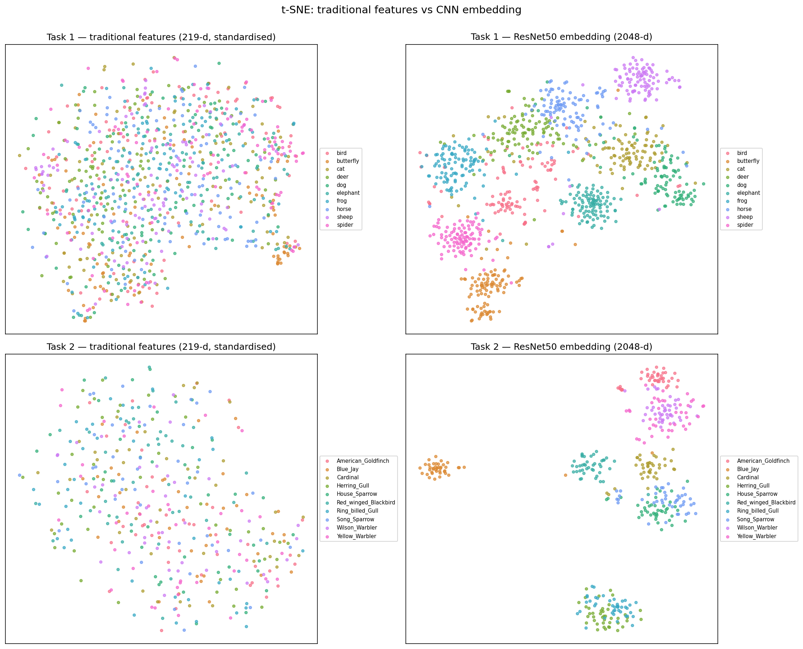

# Coarse-to-Fine-Grained Image Classification

> 粗粒度到细粒度图像分类：用 ImageNet 预训练 ResNet50 特征 + 经典分类器，把 10 类动物分类从 54.7% 提到 91.5%，10 种鸟类细粒度分类从 34.1% 提到 86.3%（5 折交叉验证）。COMP30027 Machine Learning（墨尔本大学，2026 S1）个人项目。

Individual project for COMP30027 Machine Learning, University of Melbourne, Semester 1 2026.
Two tasks share one pipeline:

| Task | Classes | Image size | Training images | Difficulty |
|---|---|---|---|---|
| Task 1 | 10 animal categories (CIFAR-10 + 4 extra classes) | 64 x 64 | 3,750 | coarse-grained |
| Task 2 | 10 bird species (CUB-200-2011 subset) | 128 x 128 | 417 | fine-grained |

## Approach

A 2 x 3 controlled design: two feature spaces x three classifiers, run identically on both tasks.

* **Feature spaces.** (a) The hand-crafted features shipped with the task: colour histogram (96-d), HOG-PCA (100-d) and edge/texture statistics (23-d), plus a 14-d HSV descriptor I engineered as an ablation. (b) A 2,048-d embedding from an ImageNet-pretrained ResNet50 (torchvision, `fc` replaced by identity, weights frozen).
* **Classifiers.** Logistic regression, RBF-SVM (C = 10) and random forest (500 trees).
* **Evaluation.** 5-fold stratified cross-validation, accuracy and macro-F1. `StandardScaler` lives inside an sklearn `Pipeline`, so it is fitted on the training folds only. A 5-fold `GridSearchCV` was run on the best Task 2 model.
* **Error analysis.** Confusion matrices and per-class F1 from out-of-fold predictions, t-SNE of both feature spaces, and a check of the confusable pairs I predicted from sample images before modelling (7 of the top 8 confused pairs matched).

## Results (5-fold CV accuracy)

| | Hand-crafted features | ResNet50 features | Gain |
|---|---|---|---|
| Task 1 (coarse) | 54.7% (LinearSVC) | **91.5%** (logistic regression) | +36.8 pp |
| Task 2 (fine-grained) | 34.1% (random forest) | **86.3%** (random forest, CNN + hand-crafted) | +52.2 pp |

Kaggle hidden test set (private leaderboard): Task 1 **93.0%**, Task 2 81.1%.

Findings worth noting:

* The fine-grained task gains more from semantic features than the coarse one, and the remaining Task 2 errors sit almost entirely in four visually similar pairs (Herring vs Ring-billed Gull, Wilson's vs Yellow Warbler, Goldfinch vs Yellow Warbler, House vs Song Sparrow).
* Tuning the random forest moved macro-F1 by only +0.25 pp, so the bottleneck on Task 2 is the representation, not the classifier.
* The HSV descriptor helps linear models on hand-crafted features a little (+0.6 to +2.6 pp) and does nothing for the random forest.

## Contents

* `report/report.pdf` - the 2,000-word report (method, results, discussion).
* `figures/` - all figures referenced in the report.
* `results/` - cross-validation tables for the 24 baseline and 12 final experiments, the grid-search result and the top confused class pairs.

The full notebook is in [comp30027-image-classification-code](https://github.com/leetaiminnn/comp30027-image-classification-code).

Tools: Python 3.11, scikit-learn, PyTorch / torchvision, pandas, matplotlib, seaborn.
